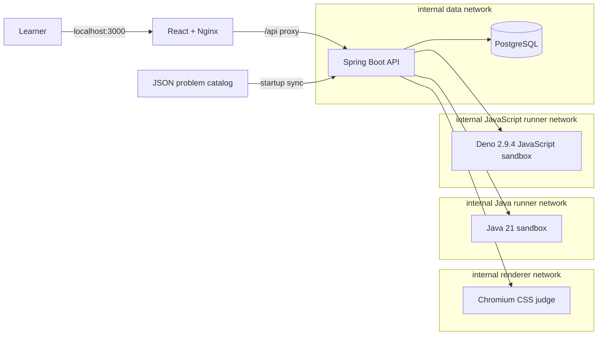

# code-quest

현재 Code Quest는 HTML부터 알고리즘까지 순서대로 실습하는 오픈소스 웹 학습 플랫폼입니다.
입문자가 직접 코드를 작성하고 즉시 결과와 피드백을 받는 용도로 설계되어 있습니다.

## 가장 쉬운 실행 방법

필요한 것은 실행 중인 **Docker Desktop**뿐입니다. 토큰이나 `.env`를 직접 만들 필요가 없습니다.
운영체제에 맞는 시작 파일이 안전한 로컬 비밀번호와 서로 다른 runner token을 자동 생성하고,
전체 서비스를 빌드한 뒤 <http://localhost:3000>을 엽니다.

| 운영체제 | 압축을 풀거나 저장소를 복제한 뒤 |
|---|---|
| macOS | `start.command`를 더블클릭하거나 터미널에서 `./start.sh` 실행 |
| Windows | `start.cmd`를 더블클릭 |
| Linux | 터미널에서 `./start.sh` 실행 |

macOS가 파일 실행을 막거나 macOS·Linux에서 실행 권한이 사라진 경우에는 프로젝트 폴더에서
다음 명령을 사용하면 됩니다.

```bash
bash start.sh
```

GitHub에서 내려받을 때는 다음 명령만 실행하면 됩니다.

```bash
git clone https://github.com/goonbam090/code-quest.git
cd code-quest

# macOS·Linux
./start.sh

# Windows에서는 start.cmd를 더블클릭
```

첫 실행은 Chromium과 Java 이미지를 내려받고 빌드하므로 인터넷 환경에 따라 몇 분 걸릴 수 있습니다.
이후 실행은 Docker 캐시를 사용해 더 빠릅니다. 자동 생성된 `.env`는 Git에서 제외되며 비밀번호와
토큰을 화면이나 로그에 출력하지 않습니다. 정상적인 기존 `.env`는 그대로 사용하고, 잘못된
runner token만 발견되면 원본을 `.env.backup-*`으로 보관한 뒤 해당 token만 자동 복구합니다.

종료해도 학습 진도를 유지하려면 다음 명령을 사용합니다.

```bash
docker compose down
```

Docker를 전혀 모르는 사용자를 위한 설치, 운영체제별 실행, 종료, 진도 보존과 오류 해결 절차는
[`START_HERE.md`](START_HERE.md)에 단계별로 정리되어 있습니다. 압축 파일을 전달받은 사용자는
이 문서부터 읽으면 됩니다.

## 학습 구성

첫 방문 시 `HTML Quest → 문서 구조 → 1번 문제`로 시작합니다. 상단 학습 흐름은
`HTML → CSS → JavaScript → Java → Algorithm`의 다섯 트랙입니다.

| 트랙 | 학습 내용 | 문제 수 |
|---|---|---:|
| HTML | 문서 구조, 폼·입력, 데이터·미디어 | 15 |
| CSS | 선택자, 기본 스타일, 위치·모션, Flex, Grid, 반응형, UI 구현 | 100 |
| JavaScript | 문법, 조건·반복, 함수, 배열·객체, Map·Set·비동기 | 30 |
| Java | 기초 → Bridge → Applied | 86 |
| Algorithm | 탐색, 정렬, 자료구조, BFS·DFS, 트리·힙·그래프 | 57 |
| 합계 | 14개 JSON 카테고리 | **288** |

CSS Quest는 `선택자 19 → 기본 스타일 24 → 위치·모션 15 → Flex 13 → Grid 12 →
반응형 7 → UI 구현 10` 순서로 진행합니다. CSS 기초부터 레이아웃과 반응형 화면까지 익힌 뒤,
카드·갤러리·채팅·상품 목록처럼 자주 만나는 UI에 적용합니다.

CSS 학습 범위는
[핵심만 골라 배우는 CSS3의 공개 커리큘럼](https://www.inflearn.com/course/%ED%95%B5%EC%8B%AC%EB%A7%8C-%EB%B0%B0%EC%9A%B0%EB%8A%94-css3?cid=336232)
흐름을 참고해 Code Quest만의 설명과 예제로 다시 구성했습니다. 강의 자료, Figma 원본,
이미지와 원문 문구는 저장소에 포함하지 않으며 해당 강의 또는 인프런의 공식 프로젝트가 아닙니다.

Java Quest 내부는 다음 세 단계로 이어집니다.

- Java 기초: 변수, 연산자, 조건문, 반복문, 문자열, 배열
- Java Bridge: 메서드, 객체, 컬렉션, 검증
- Java Applied: 객체지향, 예외, 제네릭, 람다·스트림, 실무 모델링

Java·Algorithm 트랙은 다음 순서로 이어집니다.

```text
Java 기초 문법 → 조건·반복 → 클래스·객체 → 배열·컬렉션
→ 상속·인터페이스 → 예외 처리
→ Array·List → Map·Set → Stack·Queue·Deque
→ 선형·이진 탐색 → 정렬 → BFS·DFS → 트리·힙·그래프 응용
```

JavaScript 트랙은 변수·연산에서 시작해 조건·반복, 함수·문자열, 배열·객체,
Map·Set과 `Promise` 기반 비동기 처리까지 이어집니다.

현재 콘텐츠는 프로젝트의 출발점이었던 CSS에 가장 많이 집중돼 있습니다. 문제 수보다 정확한
지식, 겹치지 않는 학습 목표와 경계값 테스트를 우선합니다. `node tools/audit-problems.mjs`가
번호 연속성, 필수 메타데이터, 중복 제목·질문, 힌트 품질, Java·JavaScript 공개·비노출 테스트
구조와 문법 학습 계약을 검사합니다.

## 일반적인 학습 흐름

1. 트랙과 카테고리를 선택합니다.
2. 문제 의도, 제한사항과 공개 예제를 확인합니다.
3. HTML·CSS·JavaScript 코드를 작성하거나 Java로 알고리즘 문제를 해결합니다.
4. 힌트와 문법 사용 예시를 확인합니다.
5. 코드를 실행하거나 브라우저 화면 결과를 검사합니다.
6. 오타·문법·개념 오류를 구분한 피드백을 확인합니다.
7. 정답 해설을 확인하고 다음 문제로 바로 이동합니다.

답안은 문제별로 자동 저장됩니다. 모든 코드 편집기와 읽기 전용 코드 화면은 줄 번호와 언어별
문법 강조를 제공하며, Enter 자동 들여쓰기와 Tab·Shift+Tab 내어쓰기를 지원합니다. 문제 탐색기,
번호 직접 이동, 진도 표시와 키보드 단축키도 제공합니다. `Ctrl/⌘ + Enter`는 답안을 채점하고,
정답 결과가 나온 뒤 다시 누르면 다음 문제 또는 다음 카테고리로 이동합니다. `Code Quest` 로고를
누르면 HTML 1번 화면으로 돌아가지만 기존 진도와 답안은 삭제되지 않습니다.

## 채점 방식

정해진 문자열과 똑같아야 정답으로 인정하는 구조가 아닙니다.

- HTML: jsoup DOM으로 시맨틱 구조, 속성 연결과 접근성을 검사
- CSS 선택자: 실제 DOM에서 선택된 목표 요소 집합을 비교
- CSS 속성·레이아웃: 격리된 Chromium에서 계산 스타일과 렌더링 결과를 비교
- Java·Algorithm: Java 21로 컴파일한 뒤 공개·비노출 테스트 실행
- JavaScript: 브라우저가 아닌 격리된 Deno 2.9.4 프로세스에서 공개·비노출 테스트 실행

구현 방식이 달라도 문제의 요구사항과 결과를 만족하면 정답으로 인정합니다. 오답은 빈 답안,
선택자·속성명 오타, 문법 오류, 단위 누락, 속성 누락, 컴파일 오류, 실행 오류, 테스트 실패와
시간 초과 등으로 구분합니다.

### 공개 저장소에서 말하는 “비노출 테스트”

이 저장소는 자가 학습용으로 문제 JSON, 기준 답안과 테스트 정의를 소스에 포함합니다. 문서와
UI에서 “숨은 테스트” 또는 “비노출 테스트”라고 부르는 것은 문제를 푸는 동안 학습자에게
**웹 UI와 런타임 API가 직접 보여주지 않는 테스트**라는 뜻입니다. 공개 저장소의 소스를 열면
해당 내용을 볼 수 있으므로 비공개 시험, 표절 방지 또는 안티치팅 경계로 사용하지 않습니다.

Java와 JavaScript 문제 모두 기준 답안과 전체 JSON 테스트 정의를 공개 문제 API 응답에서
제외합니다. JavaScript 채점도 브라우저에서 테스트를 실행하거나 테스트 JSON을 내려보내지 않고,
백엔드가 내부 Deno runner에만 전달합니다.

## 기술 스택

- Frontend: React 19.2.8, TypeScript 7.0.2, Vite 8.1.5, CodeMirror 6
- Backend: Java 21, Spring Boot 3.5.14, Spring Data JPA, Flyway
- Database: PostgreSQL 16
- Judges: Playwright 1.61.0 + Chromium, 별도 Java 21 runner, Deno 2.9.4 JavaScript runner
- Runtime: Docker Compose, Nginx
- CI: GitHub Actions

Node 패키지는 정확한 버전과 `package-lock.json`으로, Docker 기본 이미지는 digest로,
GitHub Actions는 전체 commit SHA로 고정합니다. Dependabot이 변경 사항을 주간 PR로 제안하고
CI를 통과한 업데이트만 검토해 반영할 수 있습니다.

## 아키텍처



외부 호스트에는 웹 `3000`과 개발용 API `8080`만 `127.0.0.1`로 바인딩합니다.
PostgreSQL과 세 채점 서비스는 Docker 내부 네트워크에서만 접근할 수 있습니다.
Chromium renderer, Java runner와 JavaScript runner는 각각 다른 내부 네트워크에 있고,
백엔드만 각 네트워크에 참여합니다. 두 코드 runner는 네트워크 격리에 더해 백엔드가 전달하는
서로 다른 shared secret을 검증합니다.

### 채점·저장 경계

- JSON 카탈로그가 문제 정의의 기준이며, 서버 시작 시 288문제를 PostgreSQL에 동기화합니다.
- Flyway가 데이터베이스 스키마를 이력으로 관리하고 Hibernate는 시작 시 스키마를 `validate`합니다.
- Chromium·Java·JavaScript 원격 채점은 데이터베이스 트랜잭션 밖에서 실행합니다.
- 채점이 끝난 뒤 시도 횟수와 최초 정답 상태만 짧은 트랜잭션에서 기록합니다. 같은 학습자와 문제의
  동시 제출은 PostgreSQL advisory lock으로 직렬화합니다.

따라서 느리거나 실패한 채점 요청이 데이터베이스 트랜잭션과 커넥션을 오래 점유하지 않으며,
동시 제출에서도 시도 횟수와 최초 정답 여부를 일관되게 갱신합니다.

## 사용자 코드 실행 보안

### Java

사용자 Java 코드는 신뢰하지 않는 입력으로 취급합니다.

- API·DB·CSS 채점기와 분리된 비루트 컨테이너
- 읽기 전용 루트 파일시스템과 `noexec,nosuid,nodev` 임시 공간
- Linux capability 전체 제거와 `no-new-privileges`
- 컨테이너 메모리, CPU, PID, 파일 디스크립터 제한
- 컴파일 5초, 실행 2초, 출력 24KB, 소스·요청 크기 제한
- 동시 평가 1개 제한과 초과 요청 `429`
- annotation processing 비활성화
- 제출 코드와 채점 harness 모두 Java SecurityManager 최소 권한 정책으로 실행
- Unicode escape, BiDi 제어문자, 주석 분할을 포함한 위험 API 우회 탐지
- 시간 초과 시 자식 프로세스 트리 전체 강제 종료
- Java runner 요청에 32바이트 이상의 shared secret 인증 적용
- Java runner와 renderer를 서로 통신할 수 없는 별도 내부 네트워크로 분리
- Java runner와 renderer의 외부 포트 및 인터넷 접근 차단

프론트엔드 Nginx, 백엔드와 Chromium 채점기에도 비루트 사용자, 읽기 전용 루트 파일시스템,
capability 제거, `no-new-privileges`와 자원 제한을 적용해 Java 채점기 밖의 공격 표면도 줄였습니다.

`java-runner/src/JavaRunnerServerTest.java`가 주요 우회 패턴과 실제 파일 읽기 권한 거부를
Docker 이미지 빌드 중 검증합니다.

Java 채점 컨테이너는 256 MiB 안에서 compiler JVM이 겹치지 않도록 한 번에 한 제출만 평가합니다.
장기 실행 서버는 heap 48 MiB·metaspace 32 MiB, 가장 큰 자식 JVM은 heap 56 MiB·metaspace
40 MiB로 제한하고 나머지는 native 메모리 여유로 남깁니다. 한 제출의 단계 제한은 사용자 코드
컴파일 5초 + 소스 계약 검사 2초 + 테스트 harness 컴파일 5초 + 실행 2초로 총 14초입니다.
백엔드 요청 제한은 20초, 프론트 Nginx 읽기 제한은 25초로 바깥 계층일수록 길게 설정했습니다.

삽입 정렬처럼 풀이 구조도 계약인 문제의 AST 검사는 장기 실행 서버 안에서 수행하지 않습니다.
메모리·시간이 제한된 별도 `SourceContractChecker` 프로세스가 정확한
`public class Solution.solve(int[])`만 검사하고 서버는 통과 여부와 안내문만 읽습니다.

### JavaScript

사용자 JavaScript는 브라우저가 아니라 별도 Deno 2.9.4 runner에서 채점합니다. runner 서버가
인증된 내부 요청을 받은 뒤, 제출마다 별도 자식 Deno 프로세스를 다음 권한 거부 플래그로 실행합니다.

```text
--no-prompt
--deny-read --deny-write --deny-net --deny-env
--deny-run --deny-sys --deny-ffi --deny-import
```

- 자식 프로세스 실행 제한 2.5초, 출력 제한 32KB
- 인증 직후 body 읽기부터 한 제출만 처리하며 추가 요청은 `429`로 거부
- 동적 import, 파일·네트워크·프로세스·환경·시스템·FFI 권한 거부
- `Deno`, 동적 코드 실행과 네트워크 API에 대한 사전 위험 패턴 검사
- 32바이트 이상의 별도 `JAVASCRIPT_RUNNER_TOKEN`을 요청마다 검증
- 비루트 사용자, 읽기 전용 루트 파일시스템, capability 제거, `no-new-privileges`
- 외부 포트가 없는 별도 internal Docker network와 컨테이너 자원 제한

각 테스트의 제출 코드 실행 경계는 deny-all 자식 Deno 프로세스입니다. 상위 runner는 인증,
요청 제한, 자식 수명 관리, 결과 판정과 보고서 조립만 담당합니다. 컨테이너가 예기치 않게 종료되면
Compose의 `unless-stopped` 정책으로 자동 복구되며, 운영자가 `docker compose stop
javascript-runner`로 명시적으로 중지한 경우에는 자동 재시작하지 않습니다.

> Java와 JavaScript sandbox는 교육용 로컬 플랫폼을 위한 여러 방어 계층이며, 호스트 커널을
> 공유하는 컨테이너 자체가 강한 멀티테넌트 보안 경계는 아닙니다. 불특정 사용자가 접근하는
> 서비스에서는 요청별 일회용 컨테이너와 gVisor·Kata Containers·Firecracker 같은 별도 커널
> 또는 microVM 격리를 추가해야 합니다.

## 상세 실행과 문제 해결

권장 방법은 Docker Desktop을 실행한 뒤 운영체제에 맞는 시작 파일을 사용하는 것입니다.

```bash
# macOS·Linux
./start.sh

# Windows
start.cmd
```

시작 파일은 다음 작업을 순서대로 수행합니다.

1. Docker CLI, Docker Compose와 Docker Engine 상태를 확인합니다.
2. `.env`가 없으면 암호학적으로 안전한 PostgreSQL 비밀번호와 64자리 token 두 개를 생성합니다.
3. Compose 구성을 검사합니다.
4. 모든 서비스를 빌드하고 health check가 통과할 때까지 기다립니다.
5. 브라우저에서 Code Quest를 엽니다.

직접 실행해야 하는 환경에서는 먼저 `.env.example`을 `.env`로 복사하고
`POSTGRES_PASSWORD`, `JAVA_RUNNER_TOKEN`, `JAVASCRIPT_RUNNER_TOKEN`을 교체한 뒤 다음 명령을
사용할 수도 있습니다.

```bash
docker compose up --detach --build --wait
```

예시 placeholder는 runner가 거부합니다. 두 token은 각각 32바이트 이상이어야 하고 서로 달라야
합니다. `.env`는 Git에서 제외되며 token은 로컬 서비스 간 인증용으로만 사용하고 브라우저에는
전달하지 않습니다.

- 웹: <http://localhost:3000>
- API 예시: <http://localhost:8080/api/problems?category=java>

내부 서비스 상태는 다음처럼 확인합니다.

```bash
docker compose ps
docker compose exec postgres pg_isready -U codequest -d codequest
docker compose exec renderer node -e "fetch('http://localhost:3001/health').then(r => console.log(r.status))"
docker compose exec java-runner wget -q -O - http://localhost:3002/health
docker compose exec javascript-runner wget -q -O - http://localhost:3003/health
```

종료:

```bash
docker compose down
```

로컬 DB 볼륨까지 지우는 `docker compose down --volumes`는 서버에 저장된 정답 여부와 시도
횟수를 삭제하므로 초기화가 필요한 경우에만 사용하세요. 브라우저에 자동 저장된 답안 초안과
마지막 문제 위치는 브라우저 데이터를 별도로 지워야 초기화됩니다.

`.env`를 삭제했지만 기존 `codequest-data` 볼륨이 남아 있다면 새로 생성한 PostgreSQL
비밀번호와 기존 볼륨의 비밀번호가 달라질 수 있으므로 시작 파일이 자동 실행을 중단합니다. 학습
진도를 유지해야 한다면 기존 `.env` 또는 `.env.backup-*`을 복원하세요. 진도가 필요 없는 새
설치라면 위 경고를 확인한 뒤 Docker Desktop에서 `code-quest_codequest-data` 볼륨을 삭제하고
시작 파일을 다시 실행할 수 있습니다.

### Flyway 도입 전 데이터 볼륨을 이어서 쓰는 경우

새 데이터베이스는 별도 설정 없이 Flyway migration을 적용합니다. Flyway 도입 전에 Hibernate가
만든 기존 `codequest-data` 볼륨만 먼저 백업한 뒤 다음 절차로 한 번 baseline 하세요.

```bash
docker compose down
docker compose run --rm -e FLYWAY_BASELINE_ON_MIGRATE=true backend
# "Started CodeQuestApplication" 로그를 확인한 뒤 Ctrl+C
docker compose up --build
```

`FLYWAY_BASELINE_ON_MIGRATE=true`는 기존 스키마에 Flyway 이력을 처음 만드는 이 실행에서만
사용합니다. 이후에는 기본값 `false`로 실행해야 예상하지 못한 비어 있지 않은 스키마를 자동
baseline 하는 일을 막을 수 있습니다.

## 테스트와 데이터 검증

```bash
# JSON 문제 구조·중복·힌트·테스트 계약
node tools/audit-problems.mjs

# Backend: 고정된 Maven·JDK 이미지에서 단위·통합 테스트와 패키징
docker compose build backend

# Frontend: Node.js 22 필요
(cd frontend && npm ci --no-audit --no-fund)
(cd frontend && npm audit --audit-level=high)
(cd frontend && npm run typecheck && npm test && npm run build)

# Chromium judge: 고정된 Playwright 이미지
docker compose build renderer
docker compose run --rm renderer npm test

# Java sandbox: 보안 회귀 테스트는 이미지 빌드 과정에 포함
docker compose build java-runner

# JavaScript sandbox: Deno 권한·시간·출력·위험 API 회귀 테스트는 이미지 빌드 과정에 포함
docker compose build javascript-runner

# Compose 문법과 필수 환경 변수 확인
docker compose config --quiet

# 신규 사용자에게 전달할 검증 가능한 ZIP 생성
tools/build-release-zip.sh
```

Maven 3.9.9와 JDK 21이 로컬에 설치되어 있다면 CI의 Backend 검증을
`(cd backend && mvn --batch-mode --no-transfer-progress verify)`로 직접 실행할 수도 있습니다.

전체 환경이 실행 중이면 288개 기준 답안을 실제 API와 각 채점기에 제출할 수 있습니다.

```bash
docker compose up --detach --build
node tools/audit-reference-answers.mjs
node tools/audit-grading-contracts.mjs cases
node tools/audit-grading-contracts.mjs concurrency

# renderer 장애 계약은 서비스를 외부에서 중단한 상태로 실행
docker compose stop renderer
node tools/audit-grading-contracts.mjs renderer-outage
docker compose up --detach --wait renderer

# JavaScript runner 장애 계약도 제출 시도 미기록을 검증
docker compose stop javascript-runner
node tools/audit-grading-contracts.mjs javascript-runner-outage
docker compose up --detach --wait javascript-runner
```

감사 도구는 일시적인 `429`, `502`, `503`, `504`와 채점기 가용성 오류를 jitter와 함께 제한적으로
재시도합니다. Java·알고리즘 문제와 JavaScript 문제는 각 runner의 단일 실행 계약에 맞춰
각각 1개 worker로 직렬 검증하고, 마크업·스타일 문제만 기본 2개 worker로 병렬 검증합니다.
마크업·스타일 worker 수는 `CODE_QUEST_AUDIT_WORKERS=1`부터 `4`까지 조정할 수 있습니다.
`audit-grading-contracts.mjs`는 정상 채점 상태와 시도 횟수·해설 노출, 24개 동시 제출의 원자성,
renderer·JavaScript runner 장애 시 시도 미기록 계약을 각각 검증합니다. GitHub Actions는 실제
배포 ZIP을 만들고 공백이 포함된 새 폴더에 압축을 푼 뒤, 사용자가 실행하는 것과 같은
`start.sh` 경로로 `.env` 자동 생성부터 전체 서비스를 시작합니다. 이후 문제 데이터, Backend,
Frontend, Chromium judge, Java sandbox와 JavaScript sandbox, 모든 기준 답안과 채점 회귀를
검증하고 종료 시 로그를 수집한 후 테스트용 데이터 볼륨을 제거합니다.

## 주요 API

- `GET /api/problems?category={category}`
- `GET /api/problems/{category}/{number}`
- `POST /api/problems/{category}/{number}/submissions`
- `GET /api/progress/{learnerKey}`
- `GET /api/health`

제출 예시:

```json
{
  "learnerKey": "browser-generated-uuid",
  "answer": "public class Solution { public static int solve(int a, int b) { return b + a; } }"
}
```

기준 답안과 구현 순서가 달라도 모든 테스트를 통과하면 정답으로 인정됩니다.

## 디렉터리

- `frontend/`: React 학습 UI, 코드 편집기, 미리보기
- `backend/`: 문제·채점·학습 진도 API
- `backend/src/main/resources/problems/`: PostgreSQL로 동기화되는 JSON 원본
- `renderer/`: Chromium 기반 CSS 채점기
- `java-runner/`: Java 컴파일·테스트 샌드박스
- `javascript-runner/`: Deno 기반 JavaScript 함수·테스트 샌드박스
- `tools/`: 문제 카탈로그와 전체 기준 답안 감사 도구
- `.github/workflows/ci.yml`: 전체 CI 파이프라인

## 라이선스

이 저장소에서 goonbam이 저작권을 보유하거나 해당 조건을 적용할 권한이 있는 자체 제작
코드·문제 데이터·문서는 [MIT License](LICENSE)에 따라 제공되는 오픈소스입니다.

MIT 라이선스는 저작권 고지와 라이선스 전문을 유지하는 조건으로 다음 활동을 허용합니다.

- 개인·교육·연구·기업·상업 목적의 사용과 호스팅
- 원본의 복제, 게시, 배포와 판매
- 수정, 병합, 번역과 파생 작업 제작
- 수정본의 배포, 서브라이선스(재허가)와 판매

수정본의 소스 공개나 동일 라이선스 적용을 강제하지 않는 허용형 라이선스입니다. 재배포할 때는
저작권 고지와 [LICENSE](LICENSE) 전문을 모든 복제본 또는 소프트웨어의 주요 부분에 포함해야
합니다. [NOTICE](NOTICE)는 이 저장소에 대한 적용 범위와 제3자 자료의 라이선스 경계를 설명합니다.

위 설명은 이해를 돕기 위한 요약이며, 충돌하는 경우 [LICENSE](LICENSE) 전문이 우선합니다.
저장소에 사용된 제3자 라이브러리, 도구와 기본 이미지는 각자의 라이선스를 그대로 따릅니다.
SPDX 식별자는 `MIT`입니다.

## 보안 제보

취약점은 공개 Issue에 재현 코드를 올리지 말고 GitHub의 비공개 보안 제보 기능을 사용해 주세요.
자세한 범위와 대응 기준은 [SECURITY.md](SECURITY.md)를 확인할 수 있습니다.
